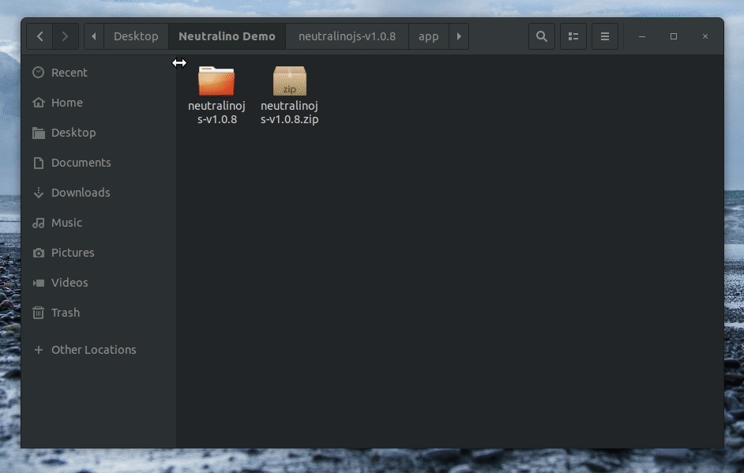
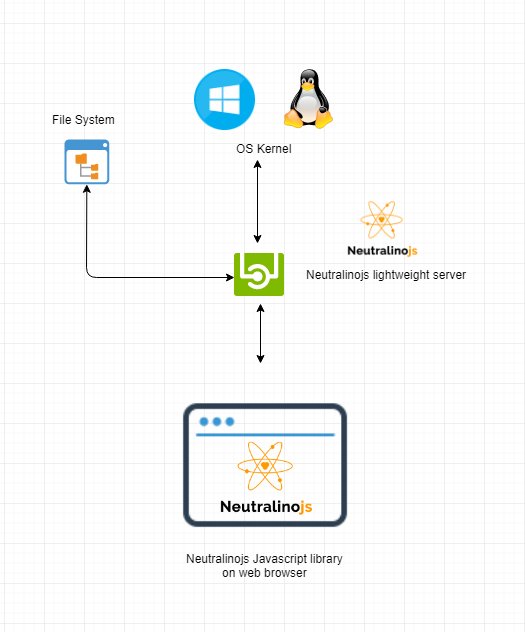

<div align="center">
  
</div>

[](https://github.com/neutralinojs/neutralinojs/blob/master/LICENSE)
 [](https://github.com/neutralinojs/neutralinojs/releases)
  [](https://github.com/neutralinojs/neutralinojs/commits/master)
[](http://hits.dwyl.io/neutralinojs/neutralinojs)
[](https://twitter.com/intent/tweet?text=NeutralinoJs%20is%20a%20portable%20and%20lightweight%20framework%20which%20lets%20you%20to%20develop%20apps%20with%20native%20functions%20that%20can%20run%20inside%20web%20browsers.%20Check%20it%20out:&url=https%3A%2F%2Fgithub.com%2Fneutralinojs%2Fneutralinojs)
[](#backers) 
<a href="https://opencollective.com/neutralinojs"></a>

Neutralino is a lightweight and portable application development framework. It lets you develop cross-platform applications using JavaScript, HTML and CSS.

[Neutralinojs vs Electron vs NW.js](https://github.com/neutralinojs/evaluation)


<div align="center">
  
</div>
 
## Why Neutralinojs? 

In Electron and NWjs you have to install NodeJs and hundreds of dependency libraries. Embedded Chromium and Node creates large overhead and makes even simple apps like “hello world” considerable in size. Neutralino offers a lightweight and portable SDK which is an alternative for Electron and NW.js also with many advantages.

Ask questions on Stackoverflow using tag [neutralinojs](https://stackoverflow.com/questions/tagged/neutralinojs)

### How it works?

<div align="center">
  
</div>

## Contribution

Help Neutralino!

- Give us a star :star:
- Fork and Clone! Awesome
- Select existing [issues](https://github.com/neutralinojs/neutralinojs/issues) or create a [new issue](https://github.com/neutralinojs/neutralinojs/issues/new) and give us a PR with your bugfix or improvement after. We love it ❤️
- Refer to this [guide](https://github.com/neutralinojs/neutralinojs/blob/master/CONTRIBUTING.md) for Contribution Procedures and Standards.

### Neutralinojs cloud

This experimental mode can be used to expose native functions for clients

```bash
./neutralino  /dev/null 2>&1 &
```
Check this [article](https://medium.com/@shalithasuranga/getting-started-with-neutralinojs-cloud-preview-version-aws-ec2-6e618d8a2ddb)

### Realtime Chat Room - Slack

- We use Slack for quick discussions. [get your invite](https://join.slack.com/t/neutralinojs/shared_invite/enQtMzk0MDU5ODMyNzM4LTc1ZjJmMzFjNjEzNjk2ODkyYWJiMTAxY2Q2OTA0MGYxNTNiMWFhMjAxMjc1M2E2NGI2OTM1ZjA1ZWNjZDFmZGU)

### Mailing List - Google Group

- Join our [Google group](https://groups.google.com/forum/#!forum/neutralinojs) for feature proposals and requests.
- You can help us by writing sample Neutralino apps,by composing or improving documentation or by writing code.

## Developer Guide

### Required tools 

To create Neutralino developer environment in your pc, install these tool kits.

- [MinGW-W64](https://mingw-w64.org/)
- [NodeJs](https://nodejs.org/en/download/)
- [Webpack Bundler](https://webpack.js.org/)
- [WebKitGTK+](https://webkitgtk.org/)

### Build Neutralino platform in Windows

```bash
> build
```

### Build Neutralino platform in Linux

Install GTk and webkit libraries

```bash
$ sudo apt-get install libgtk-3-dev
$ sudo add-apt-repository ppa:webkit-team/ppa
$ sudo apt-get update
$ sudo apt-get install libwebkit2gtk-4.0-37 libwebkit2gtk-4.0-dev
```

```bash
$ bash build.sh
```
Neutralino platform components will be assembled in to `/dist`

### Build Neutralino server in Windows

```bash
> cd core-windows
> build
```

### Build Neutralino server in Linux

```bash
$ cd core-linux
$ bash build.sh
```

Neutralino server will be compiled in `/bin`

### Build Neutralino.js with webpack

```bash
$ cd neutralino.js
$ npm install
$ npm run build
```

## Development Milestones

- [x] Solution Design
- [x] Windows Server 
- [x] Linux Server
- [x] Javascript SDK
- [x] Documentation
- [x] Web site
- [x] Security improvements
- [x] Experimental Release
- [x] Stable release
- [ ] Neutralino-packager CLI
- [ ] MacOS support

## Become a Backer

If you like to contribute by funding for sustaining our work, Please visit https://opencollective.com/neutralinojs

[](https://www.patreon.com/shalithasuranga)

## License

[MIT](LICENSE)
