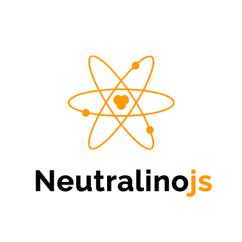

<div align="center">
  <picture>
    <source media="(prefers-color-scheme: light)" srcset="media/nllogo-light-theme.png" width="300"/>
    <source media="(prefers-color-scheme: dark)" srcset="media/nllogo-dark-theme.png" width="300"/>
    
  </picture>
 </div>

[](https://github.com/neutralinojs/neutralinojs/releases)
[](https://github.com/neutralinojs/neutralinojs/commits/main)

[](https://app.fossa.com/projects/git%2Bgithub.com%2Fneutralinojs%2Fneutralinojs?ref=badge_shield)

Neutralinojs is a lightweight and portable desktop application development framework. It lets you develop lightweight cross-platform desktop applications using JavaScript, HTML and CSS. Apps built with Neutralinojs can run on Linux, macOS, Windows, Web, and Chrome. Also, you can extend Neutralinojs with any programming language (via extensions IPC) and use Neutralinojs as a part of any source file (via child processes IPC).

- [Neutralinojs vs. Electron, NW.JS, Tauri, NodeGui, Flutter, .Net MAUI, Wails](https://github.com/Elanis/web-to-desktop-framework-comparison)
- [Roadmap 2025](https://github.com/neutralinojs/roadmap)
- [Release notes](https://neutralino.js.org/docs/release-notes/framework)

Get started with the neu CLI:

```bash
# Creating a new app
npm i -g @neutralinojs/neu
neu create hello-world
cd hello-world
neu run

# Building your app (No compilation - takes less than a second)
neu build
```

You can use your favorite frontend frameworks:

```bash
# Creating a new React-based app
neu create hello-react -t codezri/neutralinojs-react
```

Start building apps: [neutralino.js.org/docs](https://neutralino.js.org/docs)

## Why Neutralinojs?

In Electron and NWjs, you have to install NodeJs and hundreds of dependency libraries. Embedded Chromium and Node make simple apps bloaty. Neutralinojs offers a lightweight and portable SDK which is an alternative for Electron and NW.js. Neutralinojs doesn't bundle Chromium and uses the existing web browser library in the operating system (Eg: gtk-webkit2 on Linux). Neutralinojs implements a WebSocket connection for native operations and embeds a static web server to serve the web content. Also, it offers a built-in [JavaScript client library](https://github.com/neutralinojs/neutralino.js) for developers.

Ask questions on StackOverflow using the tag [neutralinojs](https://stackoverflow.com/questions/tagged/neutralinojs)

## Contributing

Please check the [contribution guide](https://neutralino.js.org/docs/contributing/framework-developer-guide). We use GitHub Discussions and Discord for quick discussions.
  * [Join on Discord](https://discord.gg/cybpp4guTJ)
  * [Start a thread on Discussions](https://github.com/neutralinojs/neutralinojs/discussions)

Neutralinojs contributors:

<a href="https://github.com/neutralinojs/neutralinojs/graphs/contributors">
  
</a>

Image created with [contributors-img](https://contributors-img.firebaseapp.com).

## Subprojects

- Builds are powered by [BuildZri](https://codezri.org/docs/buildzri/intro)
- Releases are powered by [ReleaseZri](https://codezri.org/docs/releasezri/intro)

## Sponsors and Donators

Organizations and individuals support Neutralinojs development. See: https://codezri.org/sponsors

If you like to support our work, you can donate to Neutralinojs via [Patreon](https://www.patreon.com/shalithasuranga) or [GitHub Sponsors](https://github.com/sponsors/shalithasuranga).

[](https://www.patreon.com/shalithasuranga)

## Licenses and Copyrights

- Neutralinojs core: MIT. Copyright (c) 2025 Neutralinojs and contributors.
- C++ websocket client/server library: BSD-3-Clause from [zaphoyd/websocketpp](https://github.com/zaphoyd/websocketpp). Copyright (c) 2014, Peter Thorson. All rights reserved.
- JSON parser library: MIT from [nlohmann/json](https://github.com/nlohmann/json). Copyright (c) 2013-2022 Niels Lohmann.
- Cross-platform webview library: MIT from [webview/webview](https://github.com/webview/webview). Copyright (c) 2017 Serge Zaitsev.
- Cross-platform tray library: MIT from [zserge/tray](https://github.com/zserge/tray). Copyright (c) 2017 Serge Zaitsev.
- Cross-platform GUI dialogs library: WTFPL from [samhocevar/portable-file-dialogs](https://github.com/samhocevar/portable-file-dialogs). Copyright (c) 2018—2020 Sam Hocevar
- Base64 encoder/decoder library: MIT from [tobiaslocker/base64](https://github.com/tobiaslocker/base64). Copyright (c) 2019 Tobias Locker.
- Cross-platform known platform directories API: MIT from [sago007/PlatformFolders](https://github.com/sago007/PlatformFolders). Copyright (c) 2015 Poul Sander.
- C++ logging library: MIT from [amrayn/easyloggingpp](https://github.com/amrayn/easyloggingpp). Copyright (c) 2012-2018 Amrayn Web Services. Copyright (c) 2012-2018 @abumusamq
- Cross-platform process library: MIT from [eidheim/tiny-process-library](https://gitlab.com/eidheim/tiny-process-library). Copyright (c) 2015-2020 Ole Christian Eidheim.
- Asio standalone C++ library: [Boost License v1.0](https://www.boost.org/LICENSE_1_0.txt) from [chriskohlhoff/asio](https://github.com/chriskohlhoff/asio). Copyright (c) 2003-2021 Christopher M. Kohlhoff
- Cross-platform C++ clipboard library: MIT from [dacap/clip](https://github.com/dacap/clip). Copyright (c) 2015-2021 David Capello
- Cross-platform C++ system information library: CC0 1.0 Universal from [ThePhD/infoware](https://github.com/ThePhD/infoware). Written in 2016-2020 by nabijaczleweli and ThePhD
- Cross-platform C++ filesystem watcher library: MIT from [SpartanJ/efsw](https://github.com/SpartanJ/efsw). Copyright (c) 2020 Martín Lucas Golini
- Resource injection/reading library for C++/Node.js: MIT from [nodejs/postject](https://github.com/nodejs/postject). Copyright (c) 2022 Postman, Inc
- Logo design credits: [IconsPng](https://www.iconspng.com/image/2688/atom-orange). Copyright free as mentioned on their website.

[See the complete license file](LICENSE)

[](https://app.fossa.com/projects/git%2Bgithub.com%2Fneutralinojs%2Fneutralinojs?ref=badge_large)

